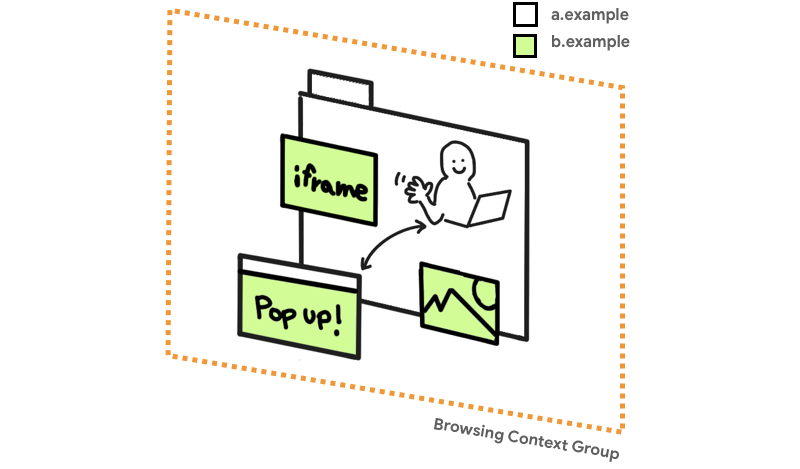
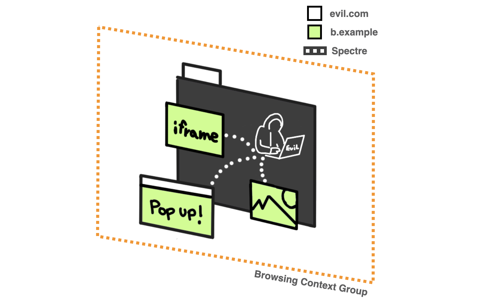
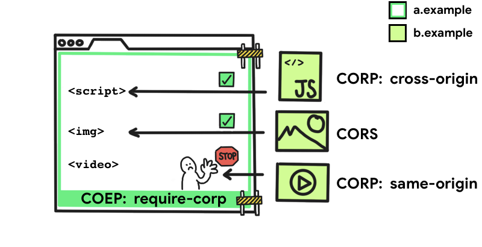
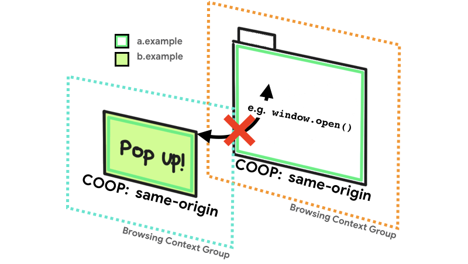
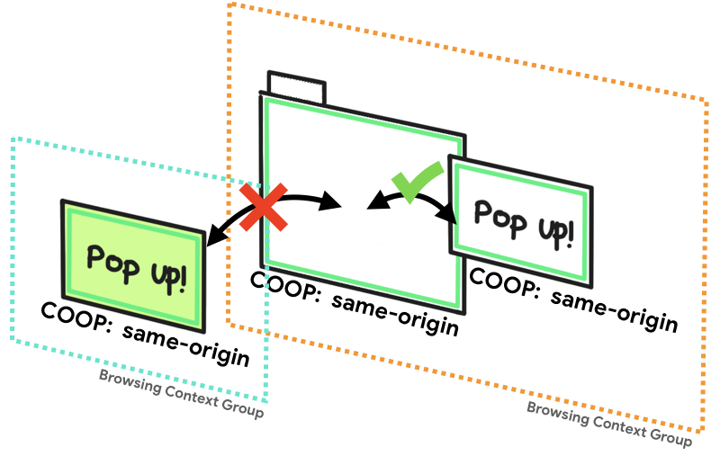
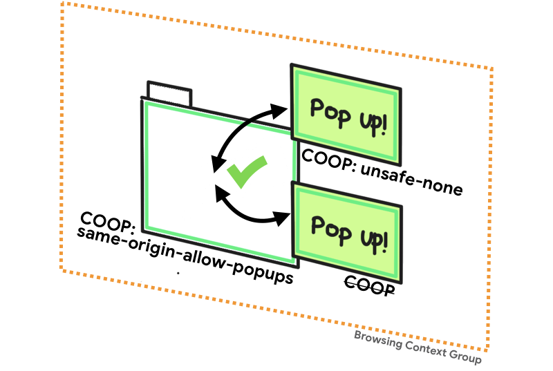

## Introduction
In [Making your website "cross-origin isolated" using COOP and
COEP](https://web.dev/coop-coep/) we explained how to adopt to "cross-origin
isolated" state using COOP and COEP. This is a companion article that explains
why cross-origin isolation is required to enable powerful features on the browser.


This article uses many similar-sounding terminologies. To make things 
clearer, let's define them first:

* [COEP: Cross Origin Embedder 
  Policy](https://wicg.github.io/cross-origin-embedder-policy/)
* [COOP: Cross Origin Opener 
  Policy](https://github.com/whatwg/html/pull/5334/files)
* [CORP: Cross Origin Resource 
  Policy](https://developer.mozilla.org/docs/Web/HTTP/Cross-Origin_Resource_Policy_(CORP))
* [CORS: Cross Origin Resource 
  Sharing](https://developer.mozilla.org/docs/Web/HTTP/CORS)
* [CORB: Cross Origin Read 
  Blocking](https://www.chromium.org/Home/chromium-security/corb-for-developers)


## Background

The web is built on the [same-origin
policy](https://web.dev/same-origin-policy/): a security feature that restricts
how documents and scripts can interact with resources from another origin. This
principle restricts the ways websites can access cross-origin resources. For
example, a document from `https://a.example` is prevented from accessing data
hosted at `https://b.example`.

However, the same-origin policy has had some historical exceptions. Any website can:
* Embed cross-origin iframes
* Include cross-origin resources such as images or scripts
* Open cross-origin popup windows with a DOM reference

If the web could be designed from scratch, these exceptions wouldn't exist.
Unfortunately, by the time the web community realized the key benefits of a
strict same-origin policy, the web was already relying on these exceptions.

The security side-effects of such a lax same-origin policy were patched in two
ways. One way was through the introduction of a new protocol called [CORS (Cross
Origin Resource Sharing)](https://developer.mozilla.org/docs/Web/HTTP/CORS)
whose purpose is to make sure that the server allows sharing a resource with a
given origin. The other way is by implicitly removing direct script access to
cross-origin resources while preserving backward compatibility. Such
cross-origin resources are called "opaque" resources. For example, this is why
manipulating the pixels of a cross-origin image via `CanvasRenderingContext2D`
fails unless CORS is applied to the image.

All these policy decisions are happening within a browsing context group.



For a long time, the combination of CORS and opaque resources was enough to make
browsers safe. Sometimes edge cases (such as [JSON
vulnerabilities](https://haacked.com/archive/2008/11/20/anatomy-of-a-subtle-json-vulnerability.aspx/))
were discovered, and needed to be patched, but overall the principle of not
allowing direct read access to the raw bytes of cross-origin resources was
successful.

This all changed with
[Spectre](https://en.wikipedia.org/wiki/Spectre_(security_vulnerability)), which
makes any data that is loaded to the same browsing context group as your code
potentially readable. If `evil.com` embeds a cross-origin image, they can use a
Spectre attack to read its pixel data, which makes protections relying on
"opaqueness" ineffective.



Ideally, all cross-origin requests should be explicitly vetted by the server
that owns the resource, in other words an opt-in approach. If vetting is not provided by
the resource-owning server, then the data will never make it into the browsing
context group of an evil actor, and therefore will stay out of reach of any Spectre
attacks a web page could carry out. We call it a cross-origin isolated state.
This is exactly what COOP+COEP is about.

Under a cross-origin isolated state, the requesting site is considered less
dangerous and unlocks powerful features such as `SharedArrayBuffer`,
`performance.measureMemory` and JS Self-Profiling API which could otherwise be
used for Spectre-like attacks. It also prevents modifying `document.domain`.

### Cross Origin Embedder Policy {: #coep }
[COEP (Cross Origin Embedder
Policy)](https://wicg.github.io/cross-origin-embedder-policy/) prevents a
document from loading any cross-origin resources which don't explicitly grant
the document permission (using CORP or CORS). With this feature, you can declare
that a document cannot load such resources. 



To activate this policy, append the following HTTP header to the document:

```http
Cross-Origin-Embedder-Policy: require-corp
```

The `require-corp` keyword is the only accepted value for COEP. This enforces
the policy that the document can only load resources from the same origin, or
resources explicitly marked as loadable from another origin.

For resources to be loadable from another origin, they need to support either
Cross Origin Resource Sharing (CORS) or Cross Origin Resource Policy (CORP).

### Cross Origin Resource Sharing {: #cors }
If a cross origin resource supports [Cross Origin Resource Sharing
(CORS)](https://developer.mozilla.org/en-US/docs/Web/HTTP/CORS), you may use the
[`crossorigin`
attribute](https://developer.mozilla.org/docs/Web/HTML/Attributes/crossorigin)
to load it to your web page without being blocked by COEP.

```html

```

For example, if this image resource is served with CORS headers, use  the
`crossorigin` attribute so that the request to fetch the resource will use [CORS
mode](https://developer.mozilla.org/docs/Web/API/Request/mode). This also
prevents the image from being loaded unless it sets CORS headers.

Similarly, you may fetch cross origin data through the `fetch()` method, which
doesn't require special handling as long as the server responds with [the right
HTTP
headers](https://developer.mozilla.org/en-US/docs/Web/HTTP/CORS#The_HTTP_response_headers).

### Cross Origin Resource Policy {: #corp }
[Cross Origin Resource Policy
(CORP)](https://developer.mozilla.org/docs/Web/HTTP/Cross-Origin_Resource_Policy_%28CORP%29)
was originally introduced as an opt-in to protect your resources from being
loaded by another origin. In the context of COEP, CORP can specify the resource
owner's policy for who can load a resource.

```http
Cross-Origin-Resource-Policy: same-site
Cross-Origin-Resource-Policy: same-origin
Cross-Origin-Resource-Policy: cross-origin
```

Resources that are marked `same-site` can only be loaded from the same site,
`same-origin` from the same origin. [`cross-origin` which was added to the CORP
spec along with COEP](https://mikewest.github.io/corpp/#integration-fetch)
declares that a resource can be loaded by any website.


Once you add the COEP header, you won't be able to bypass the restriction by
using service workers. If the document is protected by a COEP header, the policy
is respected before the response enters the document process, or before it
enters the service worker that is controlling the document.


### Cross Origin Opener Policy {: #coop }
[COOP (Cross Origin Opener
Policy)](https://github.com/whatwg/html/pull/5334/files) allows you to ensure
that a top-level window is isolated from other documents by putting them in a
different browsing context group, so that they cannot directly interact with the
top-level window. For example, if a document with COOP opens a pop-up, its
`window.opener` will be `null`. Also, the `.closed` property of the opener's
reference to it will return `true`.



The COOP header takes three values:

```http
Cross-Origin-Opener-Policy: same-origin
Cross-Origin-Opener-Policy: same-origin-allow-popups
Cross-Origin-Opener-Policy: unsafe-none
```

Documents that are marked `same-origin` can share the same browsing context
group with same-origin documents that are also explicitly marked `same-origin`.



A top-level document with `same-origin-allow-popups` retains references to any
of its popups which either don't set COOP or which opt out of isolation by
setting a COOP of `unsafe-none`.



`unsafe-none` is the default and allows the document to be added to its opener's
browsing context group unless the opener itself has a COOP of `same-origin` or
`same-origin-allow-popups`.


The
[`noopener`](https://developer.mozilla.org/en-US/docs/Web/API/Window/open#Window_features)
attribute has a similar effect to what you would expect from COOP except that it
works only from the opener side. (You can't disassociate your window when opened
by a third party.) When you attach `noopener` by doing something such as
`window.open(url, '_blank', 'noopener')` or `<a target="_blank"
rel="noopener">`, you can deliberately disassociate your window from the opened
window.

While `noopener` can be replaced by COOP, it's still useful for when you want to
protect your website in browsers that don't support COOP.


If you want guaranteed access to powerful features like `SharedArrayBuffer`,
`performance.measureMemory` or JS Self-Profiling API, just remember that your
document needs to use both COEP with the value of `require-corp` and COOP with
the value of `same-origin`. In the absence of either, the browser will not
guarantee sufficient isolation to safely enable those powerful features. You can
determine your page's situation by checking if `self.crossOriginIsolated`
returns `true`.

## Resources
* [Making your website "cross-origin isolated" using COOP and
  COEP](https://web.dev/coop-coep/)
* [COOP and COEP
  explained](https://docs.google.com/document/d/1zDlfvfTJ_9e8Jdc8ehuV4zMEu9ySMCiTGMS9y0GU92k/edit)
* [Planned changes to shared memory - JavaScript |
  MDN](https://developer.mozilla.org/docs/Web/JavaScript/Reference/Global_Objects/SharedArrayBuffer/Planned_changes)
